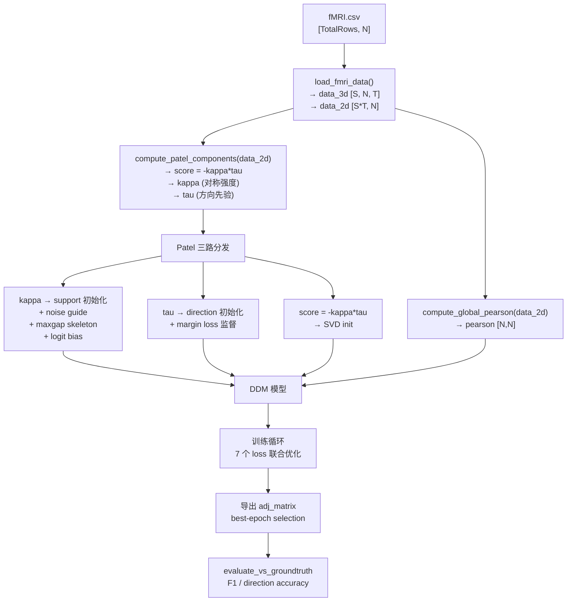
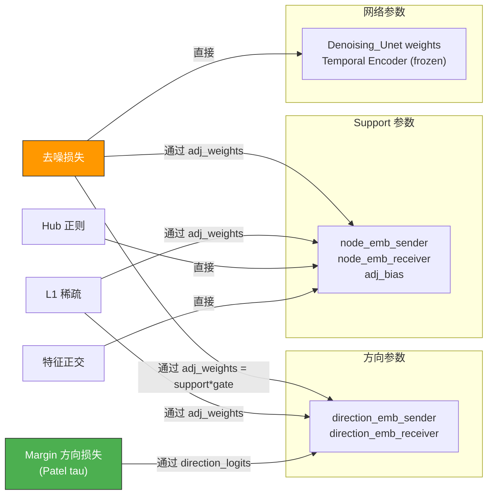

# DDM 因果学习机制深度分析

## 一、总览：数据从哪来，因果关系到哪去



---

## 二、Stage 1：原始数据 → Patel 统计量

### 数据加载
[load_fmri_data](file:///d:/mockup/DDM-main/GraphExp/main_structure_learning.py#L182-L281)

- 输入：`fMRI.csv`，无 header，shape `[TotalRows, N]`
- 按 `TIME_POINTS_PER_SUBJECT=200` 切分出 `S` 个被试
- 输出 `data_3d [S, N, T]`（模型输入）和 `data_2d [S*T, N]`（统计量计算）

### Patel 三件套计算
[compute_patel_components](file:///d:/mockup/DDM-main/GraphExp/utils/patel_util.py#L181-L217)

核心步骤：

1. **二值化**：每个节点的时间序列 → 10/90 分位数归一化到 [0,1] → 阈值 0.75 → `{0,1}`
2. **联合概率**：对所有节点对 (i,j)，计算：
   - `θ1[i,j] = P(i=1, j=1)`
   - `θ2[i,j] = P(i=1, j=0)` — **i 活跃但 j 不活跃**
   - `θ3[i,j] = P(i=0, j=1)` — **j 活跃但 i 不活跃**
   - `θ4[i,j] = P(i=0, j=0)`
3. **Kappa**（对称强度）：衡量 (i,j) 的**关联强度**，与方向无关
4. **Tau**（方向先验）：`θ2 vs θ3` 的不对称性
   - 如果 `θ2 > θ3`：i 单独活跃的概率 > j 单独活跃的概率 → i 可能是原因
   - 公式：`tau = 1 - (θ1+θ3)/(θ1+θ2)` 或 `(θ1+θ2)/(θ1+θ3) - 1`
5. **Score**：`score = -kappa * tau`（方向加权连接强度）

> [!IMPORTANT]
> Tau 不是时间滞后因果，不是 Granger 因果，不是条件方差比。它是**二值化后联合概率的不对称性**。它之所以能提供方向信息（~77%），是因为因果关系导致了"原因节点更可能单独活跃"的统计不对称。

---

## 三、Stage 2：Patel → 模型参数初始化

Patel 的三个输出被**分路**送入 DDM 模型的不同位置：

### 3.1 Support（骨架/边存在性）初始化

[DDM.__init__](file:///d:/mockup/DDM-main/GraphExp/models/DDM.py#L286-L322) 中：

```python
# score = -kappa*tau 作为 init_features 传入
support_sender, support_receiver = self._factorized_init_from_matrix(
    init_features.float(),  # patel_score_matrix
    emb_dim=self.emb_dim,
    target_std=init_logit_scale,
)
self.node_emb_sender = nn.Parameter(support_sender)    # [N, emb_dim]
self.node_emb_receiver = nn.Parameter(support_receiver)  # [N, emb_dim]
```

- 用 SVD 将 `score [N,N]` 分解为两个低秩嵌入
- 这些嵌入是**可学习参数**，会被所有 loss 的梯度更新

### 3.2 Direction（方向门控）初始化

```python
# direction_init_features = 零矩阵或 tau 矩阵
direction_sender, direction_receiver = self._factorized_init_from_matrix(
    direction_init_features.float(),
    emb_dim=self.emb_dim,
    target_std=init_logit_scale,
)
self.direction_emb_sender = nn.Parameter(direction_sender)
self.direction_emb_receiver = nn.Parameter(direction_receiver)
```

### 3.3 Kappa Logit Bias（持久骨架偏置）

[train_brain_connectivity](file:///d:/mockup/DDM-main/GraphExp/main_structure_learning.py#L1820-L1821)：

```python
kappa_logit_bias_prior = torch.maximum(patel_strength_matrix, patel_strength_matrix.t())
```

这个对称 kappa 矩阵作为 `kappa_logit_bias_prior` 被注册为 buffer（不可学习），在 [get_structure_logits](file:///d:/mockup/DDM-main/GraphExp/models/DDM.py#L361-L370) 中**永久加到** support logits 上：

```python
adj_logits = self.node_emb_sender @ self.node_emb_receiver.T + self.adj_bias
adj_logits = adj_logits + kappa_logit_bias_scale * kappa_logit_bias_prior  # 持久锚定
adj_logits = 0.5 * (adj_logits + adj_logits.T)  # 强制对称
```

### 3.4 Fixed Support Mask（maxgap 骨架掩码）

[build_undirected_kappa_skeleton](file:///d:/mockup/DDM-main/GraphExp/main_structure_learning.py#L393-L449)：

- 用对称化 kappa 的 maxgap 找到最佳截断点，选出 top-k 条无向边
- 生成二值掩码 `fixed_support_mask [N,N]`
- 在 `get_structure_adj()` 中硬乘，不在 skeleton 里的边永远为 0

### 3.5 Noise Guide Adjacency

[build_noise_guide_adjacency](file:///d:/mockup/DDM-main/GraphExp/main_structure_learning.py#L452-L475)：

- 用 kappa 选骨架 → 加自环 → 行归一化
- 注册为 `model.noise_guide_adj` buffer
- 控制前向扩散时每个节点的噪声统计量从哪些邻居聚合

---

## 四、Stage 3：邻接矩阵是如何被参数化的

这是理解因果学习的核心。

### 4.1 Support × Direction 分解

[get_structure_adj](file:///d:/mockup/DDM-main/GraphExp/models/DDM.py#L379-L402)：

```python
# Step 1: 对称 support（哪些边存在）
support_logits = get_structure_logits()      # 已强制对称
support_weights = sigmoid(support_logits)    # [0,1]
support_weights *= diag_mask                 # 零对角线
support_weights *= fixed_support_mask        # maxgap 掩码

# Step 2: 非对称 direction gate（方向门控）
direction_logits = direction_emb_sender @ direction_emb_receiver.T
direction_gate = sigmoid(direction_logits - direction_logits.T)

# Step 3: 最终邻接 = support × direction
adj_weights = support_weights * direction_gate
```

> [!IMPORTANT]
> **Direction gate 的关键性质**：`sigmoid(d_ij - d_ji)` 满足 `gate[i,j] + gate[j,i] = 1`。所以对任何一对 (i,j)：
> - 如果 `d_ij > d_ji` → `gate[i,j] > 0.5, gate[j,i] < 0.5` → i→j 方向权重更大
> - 如果 `d_ij = d_ji` → 两个方向都是 0.5（对称/无方向信息）
> 
> **Support × direction 的含义**：support 决定"这条边存不存在"，direction 决定"在两个方向之间怎么分配权重"。

### 4.2 参数的真实含义

| 参数 | 形状 | 初始化 | 控制什么 | 接收哪些梯度 |
|------|------|--------|---------|------------|
| `node_emb_sender` | [N, d] | SVD(score) | support logits | 去噪 + L1 + hub + ortho + margin(间接) |
| `node_emb_receiver` | [N, d] | SVD(score) | support logits | 同上 |
| `direction_emb_sender` | [N, d] | SVD(tau) 或 zeros | direction gate | 去噪 + margin |
| `direction_emb_receiver` | [N, d] | SVD(tau) 或 zeros | direction gate | 同上 |
| `adj_bias` | scalar | logit(density) | 全局稀疏偏移 | 去噪 + L1 |
| `kappa_logit_bias_prior` | [N,N] buffer | 对称 kappa | 持久骨架锚定 | **无**（frozen） |
| `fixed_support_mask` | [N,N] buffer | maxgap 二值 | 硬骨架约束 | **无**（frozen） |

---

## 五、Stage 4：训练循环中的 7 个 Loss

每个 epoch，对每个被试 x [N, T]，计算以下 loss 并相加：

### 5.1 去噪重建损失（Loss ①，主损失）

[DDM.forward](file:///d:/mockup/DDM-main/GraphExp/models/DDM.py#L424-L461) → [node_denoising](file:///d:/mockup/DDM-main/GraphExp/models/DDM.py#L587-L599)

```
x → temporal_encoder → x_clean [N, T]
x_clean + noise → x_t [N, T]              (sample_q, 前向扩散)
x_t → Denoising_Unet(g, x_t, t_emb, edge_weight) → x_hat [N, T]
loss = smooth_l1(x_hat, x_clean) + 0.1 * cosine_loss(x_hat, x_clean)
```

**去噪网络如何使用图结构**：

[Denoising_Unet.forward](file:///d:/mockup/DDM-main/GraphExp/models/mlp_gat.py#L64-L85)：
- `h_t = mlp_in(x_t)` → MLP 投影到隐层
- Down path: `h = GraphConv(g, h, edge_weight=adj.flatten())` × num_layers
- 每层加 time_embed
- Up path: 同样结构 + skip connection
- `out = mlp_out(h)` → 输出 x_hat

**GraphConv 中 edge_weight 的含义**：

DGL 的 `GraphConv(norm='none')` 做的是：
```
h_j' = Σ_i (edge_weight[i→j] * W * h_i)
```

`edge_weight` 就是 `adj_weights.flatten()` = `support × direction_gate`。所以**方向门控直接决定了消息传递中每条边的贡献权重**。

> [!WARNING]
> 关键问题：去噪网络的目标是最小化重建误差。对目标节点 j 来说，它需要从邻居聚合信息来恢复 x_clean_j。去噪 loss 关心的是"聚合后的消息质量"，而不是"消息来自哪个方向"。一个对称的 `adj` 可能给出相似的重建质量——这就是方向信号弱的根本原因。

### 5.2 L1 稀疏正则（Loss ②）

```python
l1_norm = torch.norm(adj_weights, p=1)
sparsity_loss = lambda_l1 * (l1_norm / n_off_diag)
```

- 对 `adj_weights`（= support × direction_gate）的绝对值求和
- 推动非重要边的权重趋向 0
- 梯度传到 support 和 direction 两组参数

### 5.3 Hub 正则（Loss ③）

```python
hub_loss = 0.01 * (sender_norms.var() + receiver_norms.var())
```

- 惩罚 support 嵌入的范数方差，防止少数节点主导所有边

### 5.4 方向 Margin 损失（Loss ④，Patel 方向监督）

[compute_directional_margin_loss](file:///d:/mockup/DDM-main/GraphExp/main_structure_learning.py#L980-L1026)

这是**唯一显式提供方向信息**的 loss。

```python
delta_prior = tau - tau.T                    # Patel 给的方向差
active_mask = |delta_prior| > median         # 只在高置信边上监督
w = active_mask * |delta_prior|              # 按置信度加权

D = direction_logits - direction_logits.T    # 模型当前的方向差
signed_D = sign(delta_prior) * D             # 正值 = 方向正确

adaptive_margin = max(1.0, quantile₂₅(signed_D))
loss = mean(w * relu(margin - signed_D))     # 违反 margin 的部分被惩罚
```

**通俗解释**：

- Patel tau 说 `tau[A,B] > tau[B,A]` → A→B 是正确方向
- 这个 loss 要求模型的 `direction_logits[A,B] - direction_logits[B,A] > margin`
- 如果模型的方向差不够大，就产生梯度推向正确方向
- 权重 `lambda_dir` 是自适应的（ratio-based + EMA + cosine anneal）

### 5.5 特征正交损失（Loss ⑤）

```python
C = S_normalized.T @ R_normalized / N       # sender 和 receiver 的互协方差
loss = sum(C²)                               # 推向零互协方差
```

- 强制 sender 和 receiver 嵌入学到不同的特征空间
- 间接改善方向学习（sender/receiver 对称等价 → 方向退化）

### 5.6 Parent Entropy / Cap 损失（Loss ⑥）

- Entropy loss：惩罚入度分布太扩散（每个节点有太多等权父节点）
- Cap loss：惩罚有效父节点数超过目标值

### 5.7 Ungated Symmetry 损失（Loss ⑦）

```python
asymmetry = |adj_causal - adj_causal.T|
loss = mean(asymmetry[ungated_pairs])
```

- 在 kappa 低（不在高置信骨架上）的节点对上，推动对称（不要在不确定的地方学方向）

### 5.8 总 Loss 合成

```python
total_loss = main_loss_weight * (去噪 + L1 + hub)
           + λ_dir * margin_loss
           + λ_ortho * ortho_loss
           + λ_cross * cross_pred_loss
           + λ_entropy * parent_entropy_loss
           + λ_cap * parent_cap_loss
           + λ_ungated * ungated_symmetry_loss
```

---

## 六、梯度流向分析：方向信息从哪来到哪去



> [!CAUTION]
> **方向参数同时接收两种梯度**：
> 
> 1. **Patel margin loss** → 推向正确方向（~77% 准确）
> 2. **去噪 loss**（通过 `adj_weights = support * gate`）→ 推向对称（anti-retentive）
> 
> 实验证明这两种梯度的余弦相似度为 **-0.307**（长期负值），且去噪梯度在方向正确位置的 push_correct 仅 **0.48**（< 0.5，即推反方向）。

---

## 七、前向扩散的噪声机制

[build_noise](file:///d:/mockup/DDM-main/GraphExp/models/DDM.py#L504-L585)

```python
eps = randn_like(x)                                    # 独立高斯
base_mean = einsum('ij,bjd->bid', noise_guide_adj, x)  # 邻居加权均值
base_var = einsum('ij,bjd->bid', noise_guide_adj, x²) - base_mean²
base_std = sqrt(clamp(base_var, min=1e-6))

raw_noise = eps * base_std       # (noise_zero_mean=True, 丢弃均值偏移)
noise = layer_norm(raw_noise)    # 归一化

x_t = sqrt(ᾱ_t) * x_clean + sqrt(1-ᾱ_t) * noise
```

**关键**：噪声的方差来自 `noise_guide_adj` 定义的邻居的统计量，但节点间的噪声是**独立的**（`eps` 是独立采样的）。没有跨节点噪声相关性。这意味着前向噪声结构不编码方向信息。

---

## 八、Best-Epoch 选择与导出

### 8.1 Epoch 质量评分（不依赖 GT）

[compute_epoch_quality](file:///d:/mockup/DDM-main/GraphExp/main_structure_learning.py#L1437-L1582)

```
score = 0.35 × skeleton_overlap       # 和 Patel kappa top-k 的重叠
      + 0.25 × agreement_score        # 和 Patel tau 方向的一致率
      + 0.20 × density_factor         # 密度接近目标
      + 0.15 × margin_score           # 方向强度 |adj[i,j]-adj[j,i]|
      + 0.05 × asymmetry_score        # 全局不对称度
```

> [!NOTE]
> 评分公式中 0.35 + 0.25 = **60% 的权重**直接来自与 Patel 的一致性。这意味着 best-epoch selection 本身就偏好和 Patel 一致的解。

### 8.2 Guardrail 过滤

通过后才能被选为 best epoch：
- `skeleton_overlap ≥ 0.50`（至少一半骨架和 Patel 一致）
- `skeleton_retention ≥ 0.85`（不能比峰值骨架退化太多）
- `density_factor ≥ 0.65`（密度合理）
- `density_ratio ≤ 2.50`（不能太密）

### 8.3 最终导出

选出 best epoch 的 `adj_matrix [N,N]`（raw convention: `A[effect, cause]`），转换为 causal convention（`A[cause, effect]`）后导出。

---

## 九、每个组件对因果学习的真实贡献

基于所有实验证据的诚实总结：

| 组件 | 学骨架（哪些边在） | 学方向（谁影响谁） |
|------|-------------------|-------------------|
| **Patel kappa** | ✅ 主力（maxgap 选骨架） | ❌ 无（对称） |
| **Patel tau** | ❌ 无 | ✅ **主力**（~77%，唯一有效方向源） |
| **kappa_logit_bias** | ✅ 持久锚定骨架 | ❌ 无（对称化） |
| **fixed_support_mask** | ✅ 硬约束骨架 | ❌ 无 |
| **去噪损失** | ✅ 辅助（微调 support 权重） | ❌ **有害**（anti-retentive） |
| **L1 正则** | ✅ 推动稀疏 | ⚠️ 间接影响（削弱弱边） |
| **Margin loss** | ❌ 无 | ✅ 把 Patel tau 注入方向参数 |
| **Ortho loss** | ❌ 无 | ⚠️ 间接（解耦 sender/receiver） |
| **Noise guide** | ⚠️ 间接（影响噪声质量） | ❌ 无 |
| **Temporal encoder** | ⚠️ 间接（更好的特征） | ❌ 无 |
| **Best-epoch selection** | ✅ 选最优骨架 | ⚠️ Patel 一致性加权 |

### 一句话总结

**骨架主要由 Patel kappa + maxgap 决定，方向完全由 Patel tau 通过 margin loss 注入。扩散去噪的作用是提供一个可微分的端到端优化框架来微调边权重，但它不产生方向信息，甚至会损害方向稳定性。**

---

## 十、方向学习的生命周期

```
Epoch 0:   direction_emb 初始化 (≈零或 tau SVD)
           direction_gate ≈ 0.5 (对称/无方向)

Epoch 1-5: warmup, margin loss 权重为 0
           去噪梯度开始塑造 support

Epoch 5-30: margin loss 激活, λ_dir 渐增
            Patel tau 开始推动方向参数
            去噪梯度同时推方向参数 → 方向对称
            两者打架 (cos ≈ -0.3)
            在某个 epoch，方向可能暂时超过 Patel 上界 (0.82)

Epoch 30:  freeze_direction_after_epoch 触发
           方向参数冻结，不再接收任何梯度
           支撑参数继续被去噪优化

Epoch 30-100: 方向固定不变
              support 继续微调
              best-epoch selection 在这个区间选出最佳 adj

Final:     导出 best epoch 的 adj_matrix
```

> [!IMPORTANT]
> 如果不冻结方向（freeze_direction_after_epoch = -1），后期去噪梯度会持续把方向拉回对称。这就是 "best > final" gap 的根本原因：方向在某个早期 epoch 达到峰值（Patel + 微弱的去噪协同），然后被去噪梯度逐渐冲掉。
