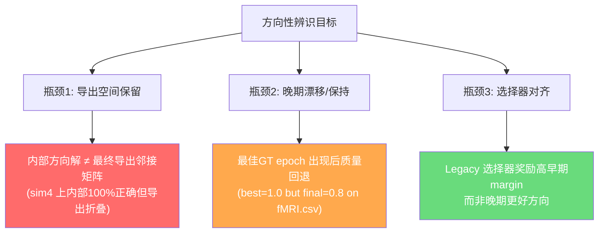

# DDM 因果结构学习：实验历程综合整理与后续方向

Last updated: 2026-03-30

---

## 一、项目总体目标

通过 DDM（方向性扩散模型）从 fMRI 时间序列数据中学习脑区间的**因果连接矩阵**。核心挑战是：

1. **骨架发现** — 哪些脑区对之间存在连接？
2. **方向辨识** — 因果关系从 A→B 还是 B→A？
3. **检查点选择** — 训练过程中如何选出最优的邻接矩阵？

---

## 二、已关闭/结论明确的实验分支

### 2.1 Cross-Prediction V1 辅助损失（`CROSS_PRED_V1_TRACKER.md`）

| 子分支 | 结论 | 关键证据 |
|--------|------|----------|
| **V1 基线 (cosine anneal)** | ❌ 不改善方向 | F1 反而下降 (0.1926→0.1333)，failure mode 仍为 `weak_asymmetry` |
| **V1 plateau 调度** | ⚠️ 部分修复 | 修正了 cosine 过早关闭辅助信号的问题，但仍不能解决 `weak_asymmetry` |
| **V1 plateau ratio 提高** | ❌ 非单调 | ratio=0.10 过度推送，0.20 不稳定 |
| **Softmax 聚合 (temp=0.1)** | ❌ 不改善 | 增加了边特异性对比度，但不改善最终方向质量 |
| **L1-only 稀疏化** | ❌ 假设Y成立 | 更强 L1 只导致均匀缩小，不产生真正稀疏化（effective parents 几乎不变） |
| **Sim3/Sim4 扩展** | ❌ 不改善 | 越大的图，均匀平均问题越严重 |
| **Lag-corr 方向先验** | ❌ 远弱于 Patel | 3-seed 正式对比：信号太弱，无法替代 Patel tau |
| **Parent entropy 正则** | ✅ 有效配合 Patel | 与 Patel margin 配合时显著提高精度 (strict_f1: 0.22→0.30) |
| **Parent cap (有效父节点上限)** | ✅ 部分有效 | 类似 entropy 的剪枝效果，但受 ~4 effective parents 下限约束 |
| **Kappa-gated directional margin** | ✅ 有用 | 选择性地仅对高 kappa 对施加方向监督 |
| **Sparsemax 邻接激活** | ✅ 在 sim3 上有效 | sparsemax + no-cap 在 sim3 上提升了方向保留 |

> [!IMPORTANT]
> **Cross-Pred V1 的核心结论**：作为辅助损失，它在当前框架中已接近极限。主要瓶颈是学习图过于密集且近均匀，而不是辅助信号强度不够。

---

### 2.2 Option B：扩散侧自主方向学习（`plan.md`）

| 阶段 | 结论 | 关键证据 |
|------|------|----------|
| **Phase 0：多滞后预测可行性** | ❌ NO-GO | sim4 方向准确率仅 0.52（阈值 0.70），sim3 更差 |
| **Phase 0B：时间步梯度探测** | ❌ FAIL | 高 t 方向梯度偏好极弱，绝对梯度边际极小 |
| **Phase 0C：边消融方向探测** | ❌ FAIL | 去噪器不含可用的隐藏方向信息 |

> [!CAUTION]
> **Option B 最终结论**：当前框架中，扩散过程**不提供**强内生因果方向学习信号。DiffuGC 风格的信号放大思路在此框架下已关闭。

---

### 2.3 Residual Patel Fusion（`plan.md`）

| 设置 | 结论 |
|------|------|
| **κ 持久先验 (scale=0.3)** | ≈ 中性，略稳定 |
| **τ 持久先验 (强/中)** | ❌ 导致低边际保持 |
| **τ 持久先验 (极小 0.02)** | ⚠️ 与基线持平，不优于 |
| **sim4 迁移** | ❌ 负迁移，仍为 symmetric_collapse |

> **实际决策**：关闭 Residual Patel 作为主优化目标，保留代码路径备用。

---

### 2.4 Time-Supervised Anti-Collapse（`plan.md`）

| 变体 | 结论 |
|------|------|
| **unsigned raw anti-collapse** | ❌ 太弱 |
| **signed_gate + online_subject** | ❌ 主体间符号冲突导致错误方向 |
| **signed_gate + global_dataset** | ✅ 首个成功反折叠 | 
| **Soft consistency weighting** | ❌ 不改善 |
| **sim4 迁移** | ❌ 内部方向分支不折叠但导出仍然折叠 |

> [!IMPORTANT]
> **关键发现**：`global_dataset + signed_gate` 在 sim3 上成功将内部方向分支驱入完全非折叠状态（`dir_active_signed_raw_frac_pos = 100%`）。但在 sim4 上，**内部方向解未能通过 support-direction 导出过程保留**。

---

## 三、当前活跃实验分支

### 3.1 Causal-Lag Main Branch（`constrict.md` — 机制线）

**状态：🟢 最强正向信号**

这是截至 2026-03-30 最有希望的方向：

| 指标 | 40-epoch Baseline | 40-epoch Causal-Lag (mean) | 变化 |
|------|-------------------|---------------------------|------|
| Best GT strict-F1 | 0.8197 | **0.8689** | +0.049 |
| Final strict-F1 | 0.7705 | **0.8033** | +0.033 |
| Forward > Reverse epochs | N/A | **35/40** | — |
| Post-freeze delta | N/A | **+0.005** (持续正) | — |

关键发现：
- `causal_lag_main_aggregation = mean` 是当前最优设置
- `softmax` 聚合反而更差
- `causal_lag_main_weight = 0.25` 是 fMRI.csv 上的局部最优
- 前向/反向重建差异在方向冻结后仍然保持正值

### 3.2 Causal-Lag-Composite Selector（`constrict.md` — 选择线）

**状态：🟢 选择器修复有效**

| 对比 | Legacy Selector | Composite Selector |
|------|----------------|-------------------|
| sim4 run_100529 导出 | epoch 9 (F1=0.803) | epoch 26 (F1=0.869) |
| Proxy vs GT 相关性 | -0.088 | **+0.709** |
| fMRI.csv 导出 | epoch 12 (F1=1.0) | epoch 13 (F1=1.0) |

复合评分公式：
```
score = 0.20 * agreement_soft + 1.0 * causal_lag_delta - 0.05 * dir_margin
```

### 3.3 fMRI.csv 机制权重扫描

**已测试权重**：0.15, 0.25, 0.35

| 权重 | 导出 F1 | 最终 F1 | 判断 |
|------|---------|---------|------|
| 0.15 | 0.6000 | 0.8000 | ❌ 太弱 |
| **0.25** | **1.0000** | 0.8000 | ✅ 当前最优 |
| 0.35 | 0.8000 | 0.8000 | ⚠️ 过度推送 |

---

## 四、已识别的核心瓶颈



### 瓶颈优先级排序

1. 🔴 **导出空间保留**（最高优先）— 在 sim4 上，学到的正确内部方向无法通过 support × direction_gate 导出
2. 🟠 **晚期保持/漂移**（高优先）— 在 fMRI.csv 上，完美 epoch 出现后会退化到 0.8
3. 🟢 **选择器对齐**（已部分修复）— causal-lag-composite 选择器在 sim4 和 fMRI.csv 上均显著改善

---

## 五、推荐后续实验方向

### 🎯 方向 1：导出空间方向保留（Mechanism Line — 最高优先）

**问题**：内部 `D - D^T` 已有正确符号，但 `support_weights × direction_gate` 导出仍近似对称。

**候选实验**：

1. **导出门控地板（Exported Gate Floor）**
   - 对高支持度方向对，强制 `sigmoid(D - D^T)` 远离 0.5
   - 直接在导出空间而非原始 logit 空间施加约束
   - 对应 `constrict.md` Line 1 候选实验 #1

2. **导出边际铰链（Exported Margin Hinge）**
   - 在导出的因果邻接矩阵上施加方向边际下限
   - 避免 logit 空间约束在导出时被支持权重淹没

3. **支持保持约束**
   - 防止方向监督对的支持权重在训练过程中退化为零
   - 解决 "方向正确但支持消失" 的问题

> [!TIP]
> 这些实验应直接与 `constrict.md` 的冻结主线对比，不修改训练目标，仅添加导出空间约束。

### 🎯 方向 2：晚期保持/漂移控制（Mechanism Line — 高优先）

**问题**：`causal_lag_main(mean)` 在 fMRI.csv 上达到完美 epoch 后向 0.8 退化。

**候选实验**：

1. **方向冻结时间优化**
   - 当前 `freeze_direction_after_epoch = 30`
   - 尝试更早/更晚冻结，观察保持行为

2. **基于 causal-lag delta 的早停**
   - 利用 forward-vs-reverse 诊断量作为早停信号
   - 当 delta 开始下降时停止/冻结

3. **晚期学习率衰减**
   - 对方向分支在冻结前施加额外衰减
   - 保持机制压力但降低过冲风险

### 🎯 方向 3：选择器权重微调（Selection Line — 中优先）

**当前状态**：composite selector 已基本修复，但权重设定基于单个 baseline。

**候选实验**：

1. **在 sim3/sim4 上进行权重小扫描**
   - 当前: `soft_agreement=0.20, lag_weight=1.0, margin_penalty=0.05`
   - 确认跨数据集稳定性

2. **多种子确认 sim4 causal-lag + composite selector**
   - 目前仅 seed=11 的 sim4 pilot
   - 需要 3-5 seed 确认效果稳定

### 🎯 方向 4：长 horizon 训练验证（Integration — 低优先）

**候选实验**：

1. **100-epoch sim4 全训练**
   - 当前最长的 causal-lag 实验只到 40 epochs
   - 验证前向/反向偏好是否在 100 epoch 仍然保持

2. **fMRI.csv 多种子确认**
   - 目前仅 seed=11 的 fMRI.csv 结果
   - 需要验证 `weight=0.25` 的最优性是否跨种子

---

## 六、当前推荐配置清单

### 机制线最优配置（sim4/fMRI.csv）

```yaml
# 结构参数化
structure_parameterization: support_direction
fixed_support_mask_mode: maxgap_kappa
direction_init_mode: random
structure_init_mode: patel_kappa
structure_init_scale: 0.5
adj_activation: sigmoid

# 方向监督
directional_prior_mode: patel
directional_schedule: plateau
directional_kappa_gate: true
directional_kappa_gate_quantile: 0.50
directional_target_ratio: 0.01

# 正则化
lambda_l1: 0.02
main_loss_weight: 1.0
freeze_direction_after_epoch: 30

# Causal-Lag Main（新机制线）
causal_lag_main_weight: 0.25
causal_lag_main_lags: 1,2
causal_lag_main_aggregation: mean

# 选择器
selection_score_mode: causal_lag_composite  # 新
selection_soft_agreement_weight: 0.20
selection_causal_lag_weight: 1.0
selection_margin_penalty_weight: 0.05
```

---

## 七、实验执行策略建议

> [!IMPORTANT]
> 根据 `constrict.md` 的约束规则：
> - **不再向主共享训练循环添加新辅助损失**
> - 每次实验必须声明：分支名称、数据集、精确声明、停止条件
> - 机制线和选择线**不混合修改**

### 推荐执行顺序

```
1. [Mechanism] sim4 导出空间门控地板 (seed=11, 40ep) → 单种子诊断
2. [Mechanism] 如 1 为正 → sim4 3-seed 确认
3. [Selection] sim4 composite selector 3-seed 确认
4. [Mechanism] fMRI.csv 晚期保持实验 (冻结时间/早停)
5. [Integration] sim4 100-epoch 全训练验证
```
