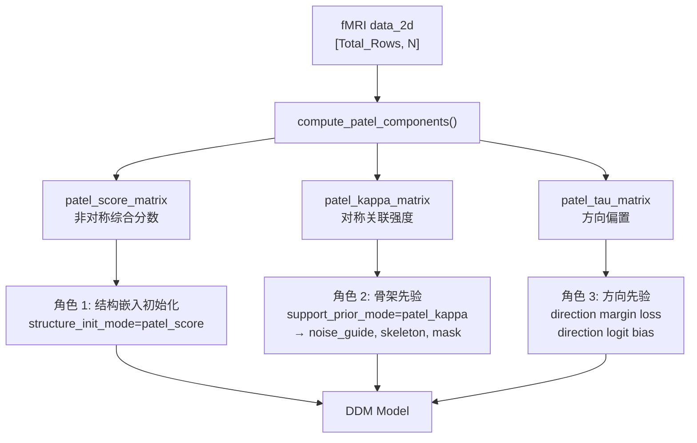
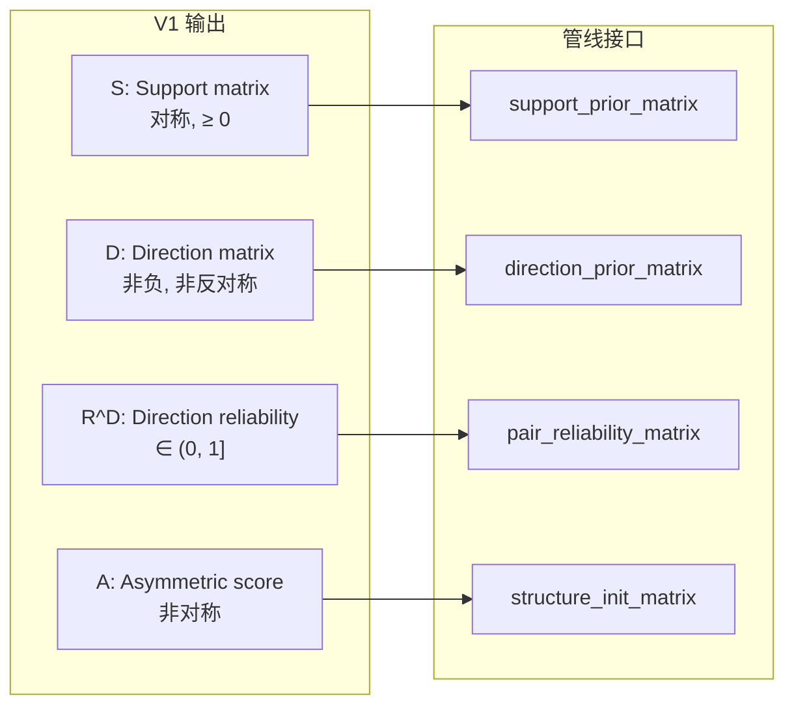

# 先验算法完整技术文档：从 Patel 到 V1 新先验

> **定位**：这是一份从头到尾的技术备忘录，记录了对当前 Patel 算法的深度解析、局限性分析、初版替代方案的讨论与修正，以及最终收敛的 V1 算法设计。
>
> **目标读者**：需要完整了解"为什么要替换、替换什么、怎么替换"的人。

---

## 目录

1. [当前 Patel 算法的完整解析](#1-当前-patel-算法的完整解析)
2. [Patel 在 DDM 管线中的三重角色](#2-patel-在-ddm-管线中的三重角色)
3. [Patel 的根本局限](#3-patel-的根本局限)
4. [初版替代方案（GAT-Prior）及其缺陷](#4-初版替代方案gat-prior及其缺陷)
5. [经三方讨论收敛的 V1 最终设计](#5-经三方讨论收敛的-v1-最终设计)
6. [V1 与现有管线的集成映射](#6-v1-与现有管线的集成映射)
7. [开放问题与后续路线](#7-开放问题与后续路线)

---

## 1. 当前 Patel 算法的完整解析

### 1.1 算法定位

Patel (2006) 方法是一种**基于事件共现的功能连接分析方法**。它不直接计算连续值的线性相关（如 Pearson），而是先把每个脑区的时间序列转换为"是否处于高激活状态"的二值事件序列，再统计两个脑区事件的共现与错位关系。

核心假设：

> 如果两个脑区经常同时处于高激活状态（共现频率超出统计独立的期望），则它们之间存在功能连接。

### 1.2 实现位置

- **算法实现**：[patel_util.py](file:///D:/mockup/DDM-main/GraphExp/utils/patel_util.py)
- **调用入口**：[main_structure_learning.py:4416](file:///D:/mockup/DDM-main/GraphExp/main_structure_learning.py#L4416)
- **输入**：`data_2d`，所有 subject 的时间序列垂直拼接成 `[Total_Rows, N]`
- **输出**：三个 `[N, N]` 矩阵 —— `score_matrix`, `kappa_matrix`, `tau_matrix`

### 1.3 四步流水线详解

#### Step 1: 预处理与二值化

**代码位置**：[\_preprocess_timeseries](file:///D:/mockup/DDM-main/GraphExp/utils/patel_util.py#L21-L49)

给定时间序列 $X \in \mathbb{R}^{T \times N}$，对每个节点 $n$：

$$\hat{X}_n = \text{clip}\left(\frac{X_n - Q_{10}(X_n)}{Q_{90}(X_n) - Q_{10}(X_n) + \varepsilon},\ 0,\ 1\right)$$

$$B_n(t) = \mathbf{1}[\hat{X}_n(t) > 0.75]$$

**各步的含义**：

| 操作                      | 目的                     | 数学效果                       |
| ------------------------- | ------------------------ | ------------------------------ |
| $Q_{10}$, $Q_{90}$ 分位数 | 鲁棒的 min/max 估计      | 不受极端离群值影响             |
| 分位数 min-max 归一化     | 映射到 $[0,1]$           | 消除脑区间绝对幅值差异         |
| clip 到 $[0,1]$           | 截断 10% 以下和 90% 以上 | 离群值被压扁                   |
| 阈值 0.75 二值化          | 标记"高激活事件"         | 只保留大约 top 20-25% 的时间点 |

**代码实现**：

```python
p10 = np.percentile(data, 10, axis=0, keepdims=True)  # [1, N]
p90 = np.percentile(data, 90, axis=0, keepdims=True)  # [1, N]
denom = p90 - p10
denom[denom == 0] = 1e-8
data_norm = np.clip((data - p10) / denom, 0, 1)
data_binary = (data_norm > 0.75).astype(np.float64)
```

> [!NOTE]
> 当前实现在 main_structure_learning.py 中是先将所有 subject 的时间序列拼接为 `data_2d`，然后在拼接后的数据上计算全局 percentile。这意味着 70 个 subject 的数据混在一起算分位数，subject 间的振幅差异会影响归一化。

#### Step 2: 联合概率矩阵

**代码位置**：[\_compute_joint_probabilities](file:///D:/mockup/DDM-main/GraphExp/utils/patel_util.py#L52-L81)

二值化后，对任意节点对 $(i, j)$，构造 $2 \times 2$ 列联表：

|                | $j=1$ 高激活                 | $j=0$ 非高激活               |
| -------------- | ---------------------------- | ---------------------------- |
| $i=1$ 高激活   | $\theta_1 = P(B_i=1, B_j=1)$ | $\theta_2 = P(B_i=1, B_j=0)$ |
| $i=0$ 非高激活 | $\theta_3 = P(B_i=0, B_j=1)$ | $\theta_4 = P(B_i=0, B_j=0)$ |

约束：$\theta_1 + \theta_2 + \theta_3 + \theta_4 = 1$

**代码利用矩阵乘法一次算出所有 $N^2$ 对**：

```python
D = data_binary.T       # [N, T]
D_not = 1 - D           # [N, T]
theta1 = (D @ D.T) / T           # P(i=1, j=1)
theta2 = (D @ D_not.T) / T       # P(i=1, j=0)
theta3 = (D_not @ D.T) / T       # P(i=0, j=1)
theta4 = (D_not @ D_not.T) / T   # P(i=0, j=0)
```

#### Step 3: Kappa — 关联强度

**代码位置**：[\_compute_kappa](file:///D:/mockup/DDM-main/GraphExp/utils/patel_util.py#L84-L139)

Kappa 度量的核心问题：**实际共激活频率 $\theta_1$ 与独立假设下的期望 $\mathbb{E}[\theta_1]$ 差了多少？**

**计算步骤**：

**(a) 独立期望**：

$$\mathbb{E}[\theta_1] = P(i\!=\!1) \cdot P(j\!=\!1) = (\theta_1 + \theta_2)(\theta_1 + \theta_3)$$

**(b) Fréchet–Hoeffding 可行区间界**：

给定边际概率 $p_i = \theta_1 + \theta_2$ 和 $p_j = \theta_1 + \theta_3$，联合概率 $\theta_1$ 的取值被限制在：

$$\theta_1^{max} = \min(p_i,\ p_j) = \min(\theta_1 + \theta_2,\ \theta_1 + \theta_3)$$

$$\theta_1^{min} = \max(0,\ p_i + p_j - 1) = \max(0,\ 2\theta_1 + \theta_2 + \theta_3 - 1)$$

> [!TIP]
> 这些界来自 Fréchet–Hoeffding 不等式。上界对应"完美正关联"（$i=1$ 当且仅当 $j=1$），下界对应"完美负关联/互斥"。

**(c) 自适应归一化权重 $W$**：

$$W = \begin{cases} 0.5 + \dfrac{\theta_1 - \mathbb{E}}{2(\theta_1^{max} - \mathbb{E} + \varepsilon)} & \text{if } \theta_1 > \mathbb{E} \\[6pt] 0.5 - \dfrac{\theta_1 - \mathbb{E}}{2(\mathbb{E} - \theta_1^{min} + \varepsilon)} & \text{if } \theta_1 \leq \mathbb{E} \end{cases}$$

$W$ 的作用是在归一化分母中对上界和下界进行**加权混合**，使得 kappa 在偏正/偏负区间内的归一化行为平滑。

**(d) Kappa 最终定义**：

$$\kappa_{ij} = \frac{\theta_1 - \mathbb{E}}{W \cdot (\theta_1^{max} - \mathbb{E}) + (1-W) \cdot (\mathbb{E} - \theta_1^{min}) + \varepsilon}$$

**性质**：

- $\kappa_{ij} = \kappa_{ji}$（**对称**，因为 $\theta_1(i,j) = \theta_1(j,i)$）
- $\kappa > 0$：共激活超出独立期望 → 正关联
- $\kappa < 0$：共激活低于独立期望 → 负关联/互斥
- $\kappa = 0$：与独立一致
- 项目中只使用 $\text{clamp}(\kappa, \min=0)$，即只取正关联作为骨架强度

#### Step 4: Tau — 方向偏置

**代码位置**：[\_compute_tau](file:///D:/mockup/DDM-main/GraphExp/utils/patel_util.py#L142-L178)

Tau 利用的是**边际不对称**：比较"谁更常单独激活"。

$$\tau_{ij} = \begin{cases} 1 - \dfrac{\theta_1 + \theta_3}{\theta_1 + \theta_2} & \text{if } \theta_2 > \theta_3 \\[6pt] \dfrac{\theta_1 + \theta_2}{\theta_1 + \theta_3} - 1 & \text{if } \theta_2 \leq \theta_3 \end{cases}$$

其中：

- $\theta_2 = P(i\!=\!1, j\!=\!0)$：$i$ 单独激活
- $\theta_3 = P(i\!=\!0, j\!=\!1)$：$j$ 单独激活

**直觉**：如果 $i$ 更常"在 $j$ 没激活时自己激活"（$\theta_2 > \theta_3$），tau 为正，暗示 $i$ 可能是上游。

**重要**：代码最终返回的是 $-\tau$，以兼容 MATLAB `Pate.m` 的符号约定：

```python
return -tau
```

> [!WARNING]
> Tau 的方向推断很弱。"谁更常单独出现" ≠ "谁是因谁是果"。它只是一种统计不对称性，没有利用时序因果结构。

#### Step 5: 组合 Score

**代码位置**：[compute_patel_components](file:///D:/mockup/DDM-main/GraphExp/utils/patel_util.py#L181-L217)

$$\text{score}_{ij} = -\kappa_{ij} \cdot \tau_{ij}$$

- $\kappa$ 提供关联强度（对称）
- $\tau$ 提供方向偏置（非对称）
- 所以 score 是**非对称矩阵**：$\text{score}_{ij} \neq \text{score}_{ji}$

最终清理：

```python
kappa = np.nan_to_num(kappa, nan=0.0, posinf=0.0, neginf=0.0)
tau = np.nan_to_num(tau, nan=0.0, posinf=0.0, neginf=0.0)
score_matrix = np.nan_to_num(score_matrix, nan=0.0, posinf=0.0, neginf=0.0)
np.fill_diagonal(kappa, 0.0)
np.fill_diagonal(tau, 0.0)
np.fill_diagonal(score_matrix, 0.0)
```

---

## 2. Patel 在 DDM 管线中的三重角色

项目把 Patel 的三个输出矩阵**拆开独立使用**，每个矩阵承担不同的功能角色。



### 角色 1: `patel_score` → 结构嵌入初始化

**代码位置**：[build_structure_init_matrix](file:///D:/mockup/DDM-main/GraphExp/main_structure_learning.py#L342-L374)

- 默认 `--structure_init_mode patel_score`
- score 是非对称矩阵 → 初始化嵌入时就带有方向偏好
- 经过 SVD 分解成 sender/receiver 嵌入对 → `node_emb_sender`, `node_emb_receiver`
- `structure_init_scale` 控制初始 logit 的标准差

```python
if mode == 'patel_score':
    init_matrix = patel_score_matrix.clone()
```

**调用链**：`patel_score_matrix` → `build_structure_init_matrix()` → `DDM.__init__()` 的 `init_features` 参数 → SVD → `node_emb_sender`, `node_emb_receiver`

### 角色 2: `patel_kappa` → 无向骨架强度

**代码位置**：[build_support_prior_matrix](file:///D:/mockup/DDM-main/GraphExp/main_structure_learning.py#L377-L391)

- 默认 `--support_prior_mode patel_kappa`
- `torch.clamp(kappa, min=0.0)` → 只保留正关联，变成**对称非负矩阵**
- 用于构建 noise guide 邻接矩阵（top-k 选边）
- 用于 fixed support mask

```python
if mode == 'patel_kappa':
    support_prior = torch.clamp(patel_kappa_matrix, min=0.0).clone()
```

**下游使用路径**：

1. **Noise guide**：[build_noise_guide_adjacency](file:///D:/mockup/DDM-main/GraphExp/main_structure_learning.py#L470-L494) → 从 kappa 中选 top-k 边 → 加自环 → 行归一化 → 传入 DDM 的 `noise_guide_adj`
2. **Fixed support mask**：根据 kappa 强度筛边，只有在 mask 内的边才能被学到
3. **Kappa logit bias**：直接作为 structure logit 的偏置项，[DDM.py:389-390](file:///D:/mockup/DDM-main/GraphExp/models/DDM.py#L389-L390)

### 角色 3: `patel_tau` → 方向弱先验

**代码位置**：方向监督的核心在 [build_directional_active_mask](file:///D:/mockup/DDM-main/GraphExp/main_structure_learning.py#L1095-L1125) 和 [compute_directional_margin_loss](file:///D:/mockup/DDM-main/GraphExp/main_structure_learning.py#L1128-L1166)

**方向监督的工作方式**：

```python
# 1. 提取方向对比（关键操作）
delta_prior = direction_prior_matrix - direction_prior_matrix.t()  # L1101

# 2. 取绝对值做阈值筛选
abs_delta_prior = torch.abs(delta_prior)
q_threshold = nonzero_vals.median()
active_mask = abs_delta_prior > q_threshold  # 约 50% 高置信边参与

# 3. 权重 = 活跃掩码 × |delta_prior| × [可选] reliability
weight_matrix = active_mask.float() * abs_delta_prior
if pair_reliability_matrix is not None:
    weight_matrix = weight_matrix * reliability  # L1124

# 4. 计算带 margin 的方向损失
D = logits - logits.t()
signed_D = torch.sign(delta_prior) * D  # 正值=方向正确
wrong_dir_penalty = F.relu(adaptive_margin - signed_D)
loss_dir = sum(w * wrong_dir_penalty) / sum(w)
```

**方向 logit bias**：在 DDM 内部，tau 还可以直接作为 logit 空间的偏置。代码先做 skew-symmetric 处理：

```python
# DDM.py L255-257
direction_logit_bias_prior = 0.5 * (
    direction_logit_bias_prior - direction_logit_bias_prior.transpose(0, 1)
)
```

然后在 `get_direction_logits()` 中加上：

```python
direction_logits = direction_logits + direction_logit_bias_scale * direction_logit_bias_prior
```

### 方向约定

> [!IMPORTANT]
> **项目内部邻接矩阵的约定**：
>
> - **Raw 约定**：`A_raw[effect, cause]` — 内部使用
> - **Causal 约定**：`A_causal[cause, effect]` — 用于评估和导出
> - 两者差一个转置：[to_causal_matrix_torch](file:///D:/mockup/DDM-main/GraphExp/main_structure_learning.py#L394-L403)
>
> Tau 保留的是 Pate.m 风格符号。喂给方向 logit bias 时，代码会做 skew-symmetric 处理来适配约定。

---

## 3. Patel 的根本局限

### 3.1 硬二值化的信息损失

```
原始信号:  [0.31, 0.85, 0.72, 0.91, 0.65, 0.78, 0.95, 0.42]
                     ↓ normalize, threshold 0.75
二值化后:  [  0,    1,    0,    1,    0,    1,    1,    0  ]
```

- 0.74 和 0.76 的差异被放大到 0 vs 1（阈值效应）
- 0.76 和 0.99 被压缩为同一个 1（信息丢失）
- 所有"非高激活"状态被统一视为 0，丧失了弱-中等-强的梯度信息

### 3.2 单阈值敏感性

0.75 是一个**硬编码的全局常数**，对所有脑区、所有 subject 一视同仁。但不同脑区可能有不同的最优阈值。

### 3.3 完全丢弃时序结构

Patel 把时间序列当作 **i.i.d. 二值样本**处理——$T$ 个时间点的顺序被完全忽略。但因果性本质上是时序概念（因在果之前）。对 fMRI 时序数据，这是最根本的缺陷。

### 3.4 方向信号（Tau）太弱

"谁更常单独激活"作为因果方向的代理变量，在以下场景下失效：

- **混杂因素**：共同驱动源会导致 tau 虚假偏移
- **HRF 差异**：不同脑区血流动力学响应函数的差异，造成激活时间偏移，与真实因果方向无关
- **低信噪比**：当 $\theta_2 \approx \theta_3$ 时，tau 退化为噪声

### 3.5 简单拼接所有 Subject

当前实现把所有 subject 的时间序列直接拼成一个长序列：

```python
data_2d = torch.from_numpy(data_3d_np.reshape(-1, num_nodes))  # L274
patel_result = compute_patel_components(data_2d.numpy())         # L4416
```

问题：

- 全局 percentile 计算混合了 subject 间的振幅差异
- 个体间变异被平均掉
- 拼接点处的时间不连续性被忽略

---

## 4. 初版替代方案（GAT-Prior）及其缺陷

### 4.1 初始提案

提出了一个叫 "Graded Asymmetric Transfer Prior" (GAT-Prior) 的方案，输出三个矩阵替换 Patel 的三个输出。

### 4.2 被指出的主要问题

| 问题                                   | 描述                                                                                                                           | 修正方向                                          |
| -------------------------------------- | ------------------------------------------------------------------------------------------------------------------------------ | ------------------------------------------------- |
| **gamma ≥ 0 不成立**                   | gamma 定义为多阈值软变换后的平均 Pearson 相关，天然可负。不能直接替换 support prior（要求非负）                                | 改成 soft Patel kappa：保留 bounded normalization |
| **delta 不是 transfer entropy**        | 没有条件化 target 自身历史，只是 autocorrelation-corrected lagged cross-covariance。无法区分"X 预测 Y"和"Y 自相关+X 与 Y 相关" | 改成 self-history-conditioned lag gain            |
| **"代码不用改" 判断不对**              | 管线中有大量隐式依赖 Patel 尺度的地方（selector agreement, directional loss 阈值, direction_logit_bias_scale 乘法）            | 需要 range calibration                            |
| **Per-subject median 对 lag 指标太噪** | 200 个 time point 算 lag asymmetry 方差大                                                                                      | 用 shrinkage 或 robust aggregation                |
| **score 严格反对称**                   | gamma(对称) × delta(反对称) = 反对称，不适合做 coupled structure init                                                          | S 和 D 分开使用                                   |
| **GAT 命名冲突**                       | 容易和 Graph Attention Network 混淆                                                                                            | 重新命名                                          |

### 4.3 关键共识

> **保留 Patel 最有价值的部分（deviation-from-independence + feasible-bound normalization），只替换最弱的部分（硬二值化 → 软多阈值；静态边际不对称 → 时滞预测增益）**

---

## 5. 经三方讨论收敛的 V1 最终设计

### 5.0 设计哲学

**一句话概括**：

> **Soft Patel Support + Self-History-Conditioned Lagged Predictive Gain**
> （软 Patel 支持强度 + 条件于自身历史的时滞预测增益）

**输出 4 个量**：

| 输出                     | 符号  | 性质           | 替代 Patel 的  | 对接管线中的              |
| ------------------------ | ----- | -------------- | -------------- | ------------------------- |
| Support matrix           | $S$   | 对称, ≥ 0      | kappa          | `support_prior_matrix`    |
| Forward direction matrix | $D$   | 非负, 非反对称 | tau            | `direction_prior_matrix`  |
| Direction reliability    | $R^D$ | ∈ (0, 1]       | 无对应（新增） | `pair_reliability_matrix` |
| Asymmetric score         | $A$   | 非对称         | score          | `structure_init_matrix`   |

### 5.1 Step 1: 鲁棒归一化

对每个 subject $s$，每个节点 $i$：

$$\hat{X}_i^{(s)}(t) = \text{clip}\left(\frac{X_i^{(s)}(t) - Q_{10}(X_i^{(s)})}{Q_{90}(X_i^{(s)}) - Q_{10}(X_i^{(s)}) + \varepsilon},\ 0,\ 1\right)$$

同时定义用于时滞建模的标准化序列：

$$Z_i^{(s)}(t) = \frac{\hat{X}_i^{(s)}(t) - \mu_i^{(s)}}{\sigma_i^{(s)} + \varepsilon}$$

- $\hat{X}$：保留在 $[0,1]$，用于 Support 计算
- $Z$：零均值、单位尺度，用于 Direction 回归

> [!IMPORTANT]
> **与当前 Patel 的关键区别**：归一化是 **per-subject** 的，不是在拼接后的全局数据上做。这消除了 subject 间振幅差异的混杂。

### 5.2 Step 2: Soft Bounded Event Support ($S$)

#### 5.2.1 多阈值软事件映射

取 $K$ 个均匀分布的阈值：

$$\tau_k = \frac{k}{K+1}, \quad k = 1, \dots, K$$

默认 $K = 5$，即 $\tau_k \in \{0.167, 0.333, 0.500, 0.667, 0.833\}$

对每个阈值，用 sigmoid 做**软二值化**（而非硬 step function）：

$$\phi_{i,k}^{(s)}(t) = \sigma\big(\beta \cdot (\hat{X}_i^{(s)}(t) - \tau_k)\big)$$

- $\beta$ 控制软化程度。默认 $\beta = 10$
- 当 $\beta \to \infty$ 时退化为硬二值化
- 当 $K=1, \tau_1=0.75, \beta \to \infty$ 时退化为 **per-subject-normalized Patel-like variant**。注意：由于 V1 使用 per-subject normalization（见 5.1）而当前 Patel 使用 pooled global normalization，两者**数值上不完全一致**。结构形态一致但归一化路径不同。

#### 5.2.2 Soft contingency masses（软四格矩）

对每个 subject $s$ 和阈值 $k$，计算软版本的 $\theta$ 矩阵：

$$q_{11}^{(s,k)}(i,j) = \frac{1}{T_s} \sum_{t=1}^{T_s} \phi_{i,k}^{(s)}(t) \cdot \phi_{j,k}^{(s)}(t)$$

$$q_{10}^{(s,k)}(i,j) = \frac{1}{T_s} \sum_{t=1}^{T_s} \phi_{i,k}^{(s)}(t) \cdot \big(1 - \phi_{j,k}^{(s)}(t)\big)$$

$$q_{01}^{(s,k)}(i,j) = \frac{1}{T_s} \sum_{t=1}^{T_s} \big(1 - \phi_{i,k}^{(s)}(t)\big) \cdot \phi_{j,k}^{(s)}(t)$$

$$q_{00}^{(s,k)}(i,j) = \frac{1}{T_s} \sum_{t=1}^{T_s} \big(1 - \phi_{i,k}^{(s)}(t)\big) \cdot \big(1 - \phi_{j,k}^{(s)}(t)\big)$$

> [!NOTE]
> **数学验证已完成**：
>
> 1. $q_{11} + q_{10} + q_{01} + q_{00} = 1$ 对任意 $\phi \in (0,1)$ **恒成立**
> 2. 设 $p_i = q_{11} + q_{10}$, $p_j = q_{11} + q_{01}$，则 $\max(0, p_i+p_j-1) \leq q_{11} \leq \min(p_i, p_j)$ **仍然成立**
> 3. 因此 Patel 的 bounded normalization 在软版本下**代数完整**
>
> 准确命名：这些量是 **soft contingency masses**，不是严格的 hard event probabilities。

#### 5.2.3 Subject 加权池化

按 subject 长度加权池化 sufficient statistics：

$$\bar{q}_{ab}^{(k)}(i,j) = \frac{\sum_s T_s \cdot q_{ab}^{(s,k)}(i,j)}{\sum_s T_s}$$

当所有 $T_s$ 相等时，这等价于在 per-subject-normalized 拼接数据上直接计算。

#### 5.2.4 Bounded normalization（直接沿用 Patel 数学骨架）

对池化后的 $\bar{q}^{(k)}$，套用 Patel 的 bounded normalization：

$$\mathbb{E}^{(k)} = (\ \bar{q}_{11}^{(k)} + \bar{q}_{10}^{(k)}\ )(\ \bar{q}_{11}^{(k)} + \bar{q}_{01}^{(k)}\ )$$

$$U^{(k)} = \min(\ \bar{q}_{11}^{(k)} + \bar{q}_{10}^{(k)},\quad \bar{q}_{11}^{(k)} + \bar{q}_{01}^{(k)}\ )$$

$$L^{(k)} = \max(\ 0,\quad 2\bar{q}_{11}^{(k)} + \bar{q}_{10}^{(k)} + \bar{q}_{01}^{(k)} - 1\ )$$

$$W^{(k)} = \begin{cases} 0.5 + \dfrac{\bar{q}_{11}^{(k)} - \mathbb{E}^{(k)}}{2(U^{(k)} - \mathbb{E}^{(k)} + \varepsilon)} & \text{if } \bar{q}_{11}^{(k)} > \mathbb{E}^{(k)} \\[6pt] 0.5 - \dfrac{\bar{q}_{11}^{(k)} - \mathbb{E}^{(k)}}{2(\mathbb{E}^{(k)} - L^{(k)} + \varepsilon)} & \text{if } \bar{q}_{11}^{(k)} \leq \mathbb{E}^{(k)} \end{cases}$$

$$\bar{\kappa}^{(k)} = \frac{\bar{q}_{11}^{(k)} - \mathbb{E}^{(k)}}{W^{(k)} \cdot (U^{(k)} - \mathbb{E}^{(k)}) + (1 - W^{(k)}) \cdot (\mathbb{E}^{(k)} - L^{(k)}) + \varepsilon}$$

#### 5.2.5 多阈值聚合（含有效性检查）

**阈值有效性检查**：如果某个阈值 $\tau_k$ 导致大部分节点的软事件方差过低，则跳过：

$$\text{如果 } \text{median}_i\, \text{Var}_t(\phi_{i,k}(t)) < v_{min}, \quad \text{则 threshold } k \text{ 无效}$$

默认 $v_{min} = 0.01$

**最终 Support**：

$$S_{ij} = \frac{1}{|K_{valid}|} \sum_{k \in K_{valid}} [\bar{\kappa}_{ij}^{(k)}]_+$$

其中 $[x]_+ = \max(x, 0)$

**S 的性质**：

- ✅ 对称：$S_{ij} = S_{ji}$
- ✅ 非负：$S_{ij} \geq 0$
- ✅ 可直接替换 `support_prior_matrix`
- ⚠️ 退化行为：当 $\beta \to \infty, K=1, \tau_1=0.75$ 时，S 退化为 **per-subject-normalized Patel kappa 的 ReLU 版**，与当前仓库中的 `patel_kappa`（pooled global normalization）数值上不完全一致，但代数结构相同

> [!WARNING]
> **β 下界检查**：当 $\beta < 8$ 时，所有 $\phi$ 值集中在 0.5 附近，方差趋零，kappa 全面退化到 0。建议 $\beta \geq 8$ 并在代码中加 warning。

### 5.3 Step 3: Forward Direction Matrix ($D$) — 时滞预测增益

#### 5.3.1 直觉

如果 $i$ 是 $j$ 的因，那么 $i$ 的过去应该能**在控制 $j$ 自身历史的前提下**额外提高对 $j$ 未来的预测。这比 Patel tau 的"谁更常单独出现"有本质提升。

正式名称：**self-history-conditioned lagged predictive gain**（条件于自身历史的时滞预测增益）

> [!IMPORTANT]
> 这不是 transfer entropy，也不是严格的 Granger F-statistic。它省略了自由度校正和 F 分布检验。但作为先验只需要排序正确性，不需要 p-value。

#### 5.3.2 数学定义

设 lag 集合为 $\mathcal{L} = \{\ell_1, \dots, \ell_m\}$（$\ell_r > 0$），默认 $\mathcal{L} = \{1,2,3,4,5\}$。

给定 lag 权重 $w_r \geq 0$（可直接复用 `--causal_lag_main_lag_weights`）。

**目标自身历史向量**（对每个 target 节点 $j$）：

$$h_j(t) = \big[\sqrt{w_1}\, Z_j(t-\ell_1),\ \dots,\ \sqrt{w_m}\, Z_j(t-\ell_m)\big]^\top \in \mathbb{R}^m$$

**来源历史向量**（对每个 source 节点 $i$）：

$$g_i(t) = \big[\sqrt{w_1}\, Z_i(t-\ell_1),\ \dots,\ \sqrt{w_m}\, Z_i(t-\ell_m)\big]^\top \in \mathbb{R}^m$$

**(a) Target 自身历史基线**（ridge regression）：

$$a_j^\star = \arg\min_{a} \sum_{t=\ell_{max}+1}^{T} \big(Z_j(t) - a^\top h_j(t)\big)^2 + \lambda \|a\|_2^2$$

残差方差：

$$e_j^{self} = \frac{1}{T - \ell_{max}} \sum_{t} \big(Z_j(t) - {a_j^\star}^\top h_j(t)\big)^2$$

**(b) Source 增广模型**（联合 ridge regression）：

$$(a_{ij}^\star, b_{ij}^\star) = \arg\min_{a,b} \sum_{t} \big(Z_j(t) - a^\top h_j(t) - b^\top g_i(t)\big)^2 + \lambda(\|a\|_2^2 + \|b\|_2^2)$$

增广残差方差：

$$e_{i \to j}^{aug} = \frac{1}{T - \ell_{max}} \sum_{t} \big(Z_j(t) - {a_{ij}^\star}^\top h_j(t) - {b_{ij}^\star}^\top g_i(t)\big)^2$$

**(c) 前向方向增益**：

$$D_{ij} = \max\left(0,\ 1 - \frac{e_{i \to j}^{aug}}{e_j^{self} + \varepsilon}\right)$$

**D 的含义**：

- $D_{ij} > 0$：source $i$ 的过去**在控制 $j$ 自身历史后**仍能降低对 $j$ 的预测误差 → 暗示 $i \to j$
- $D_{ij} = 0$：source $i$ 无法提供超出 $j$ 自身历史的额外预测信息
- $D_{ij}$ 和 $D_{ji}$ 可以**同时为正**（双向信息流），这是合理的

**D 的性质**：

- ✅ 非负：$D_{ij} \geq 0$
- ❌ 不是反对称的：$D_{ij} \neq -D_{ji}$
- ✅ 这正是正确的设计（见下文 5.3.3）

#### 5.3.3 为什么 D 不应该是反对称的

当前代码的方向监督机制是：

```python
delta_prior = direction_prior_matrix - direction_prior_matrix.t()  # L1101
```

如果传入反对称矩阵 $\Delta$，代码会算 $\Delta - \Delta^T = 2\Delta$，语义不变但**尺度翻倍**，影响 `q_threshold` 和 `adaptive_margin`。

传入非反对称的 $D$，让代码自己做 $D - D^T$ 提取方向对比，**接口最干净**。

#### 5.3.4 边界情况

当 $e_j^{self} \approx 0$（target 完全可以被自身历史预测）：

- 分母 $≈ \varepsilon$
- 分子 $e_j^{self} - e_{i\to j}^{aug} \leq 0$（增广模型不可能比完美基线更好）
- $D_{ij} = 0$

这是合理行为：如果 $j$ 完全自回归，没有外部 source 能提供额外信息，方向先验应该退化。

#### 5.3.5 Per-subject 计算与聚合

**每个 subject 单独计算** $D^{(s)}$（必须，因为时滞建模需要时间连续性）：

$$D_{ij}^{(s)} = \max\left(0,\ 1 - \frac{e_{i \to j, aug}^{(s)}}{e_{j, self}^{(s)} + \varepsilon}\right)$$

**跨 subject 中位数聚合**：

$$D_{ij} = \text{median}_s\, D_{ij}^{(s)}$$

#### 5.3.6 计算成本分析

默认参数 $N=50, m=|\mathcal{L}|=5, T=200$：

| 步骤                                                 | 每个 subject | 可向量化？          |
| ---------------------------------------------------- | ------------ | ------------------- |
| Self-history regression ($N$ 个 $m \times m$ ridge)  | ~244K ops    | ✅ batch            |
| Augmented regression ($N^2$ 个 $2m \times 2m$ ridge) | ~49M ops     | ✅ per target batch |
| 100 subjects 总计                                    | ~4.9B ops    | numpy 秒级完成      |

**一次性开销**，不在训练循环内。对当前管线没有性能影响。

### 5.4 Step 4: Direction Reliability ($R^D$)

定义每个 subject 的方向对比：

$$\Delta_{ij}^{(s)} = D_{ij}^{(s)} - D_{ji}^{(s)}$$

可靠度用 robust coefficient of variation 的变换定义：

$$R_{ij}^D = \exp\left(-\frac{\text{MAD}_s(\Delta_{ij}^{(s)})}{\text{median}_s |\Delta_{ij}^{(s)}| + \varepsilon}\right)$$

其中 MAD 是 **median absolute deviation**（中位绝对偏差）。

**性质**：

- $R^D \in (0, 1]$
- CV → 0（一致） → $R^D → 1$（高可信）
- CV → ∞（不一致） → $R^D → 0$（低可信）

**对接路径**：$R^D$ 需要接入 [build_directional_active_mask](file:///D:/mockup/DDM-main/GraphExp/main_structure_learning.py#L1095-L1125) 的 `pair_reliability_matrix` 参数，代码会用它调制方向损失权重：

```python
weight_matrix = weight_matrix * reliability  # L1124
```

> [!CAUTION]
> **当前主训练路径缺少 R^D 的接线**。`build_directional_active_mask` 和 `compute_directional_margin_loss` 函数本身已支持 `pair_reliability_matrix` 参数，但：
>
> 1. `train_brain_connectivity()` 函数签名中**没有** `direction_prior_reliability_matrix` 参数（[L2357](file:///D:/mockup/DDM-main/GraphExp/main_structure_learning.py#L2357)）
> 2. 主训练循环中两处 `compute_directional_margin_loss()` 调用都**没传** reliability（[L3173](file:///D:/mockup/DDM-main/GraphExp/main_structure_learning.py#L3173), [L3404](file:///D:/mockup/DDM-main/GraphExp/main_structure_learning.py#L3404)）
> 3. 目前**只有**梯度探针分支 `compute_direction_grad_alignment_diagnostics` 支持 reliability（[L857](file:///D:/mockup/DDM-main/GraphExp/main_structure_learning.py#L857)）
>
> **实现时必须补齐的 plumbing**：
>
> - `train_brain_connectivity()` 新增参数 `direction_prior_reliability_matrix: Optional[torch.Tensor] = None`
> - 两处 `compute_directional_margin_loss()` 调用补充 `pair_reliability_matrix=direction_prior_reliability_matrix`
> - `main()` 入口传入 `R^D` 矩阵

> [!WARNING]
> 当 subject 数量 $S < 5$ 时，MAD 和 median 估计本身不稳定。建议 fallback：
>
> ```python
> if num_subjects < 5:
>     R_D = np.ones_like(delta_aggregated)
> ```

### 5.5 Step 5: Asymmetric Init Score ($A$)

先做**分位数稳健缩放**（range calibration）：

$$\tilde{S}_{ij} = \frac{S_{ij}}{Q_{0.95}(S_{off}) + \varepsilon}$$

$$\widetilde{\Delta}_{ij} = \frac{\Delta_{ij}}{Q_{0.90}(|\Delta_{off}|) + \varepsilon}$$

其中 $\Delta = D - D^T$，$off$ 表示非对角元素。

组合：

$$A_{ij} = \tilde{S}_{ij} \cdot \tanh(\alpha \cdot \widetilde{\Delta}_{ij})$$

**含义**：

- $\tilde{S}$（support）决定"该不该连"
- $\tanh(\alpha \cdot \widetilde{\Delta})$（direction contrast）决定"往哪边偏"
- $\tanh$ 防止方向极值打爆初始化

> [!IMPORTANT]
> **A 的方向约定**：$D_{ij}$ 定义为 "source $i$ 帮助预测 target $j$" → $\Delta_{ij} = D_{ij} - D_{ji} > 0$ 意味着 $i \to j$。因此 $A$ 使用的是 **causal convention**（$A[cause, effect]$）。
>
> 当前代码中 `patel_score` 是 raw convention，所以 A 对应的是 `patel_score_t`（转置版），而不是 `patel_score`。
>
> 具体映射：
>
> - 如果 `structure_init_mode = 'patel_score'`（raw convention）→ 传入 `A.T`
> - 如果 `structure_init_mode = 'patel_score_t'`（causal convention）→ 传入 `A`
> - 或者新增 `structure_init_mode = 'lag_gain_score'` 并在 `build_structure_init_matrix` 内部处理约定转换
>
> 参考：[build_structure_init_matrix](file:///D:/mockup/DDM-main/GraphExp/main_structure_learning.py#L342-L374) 中 `patel_score` vs `patel_score_t` 的区分

### 5.6 默认超参数

| 参数             | 符号          | 默认值                             | 说明                        |
| ---------------- | ------------- | ---------------------------------- | --------------------------- |
| 软阈值数量       | $K$           | 5                                  | 均匀覆盖 $[0,1]$            |
| 阈值软化程度     | $\beta$       | 10                                 | ≥ 8 避免退化                |
| Lag 集合         | $\mathcal{L}$ | {1,2,3,4,5}                        | 对齐 `causal_lag_main_lags` |
| Lag 权重         | $w_r$         | 复用 `causal_lag_main_lag_weights` | —                           |
| Ridge 正则化     | $\lambda$     | $10^{-3}$                          | 数值稳定性                  |
| Score 方向灵敏度 | $\alpha$      | 1.0                                | 控制 tanh 饱和速度          |
| 阈值有效性下界   | $v_{min}$     | 0.01                               | 跳过低方差阈值              |
| 数值稳定常数     | $\varepsilon$ | $10^{-8}$                          | —                           |

---

## 6. V1 与现有管线的集成映射

### 6.1 输出 → 接口映射



### 6.2 代码变更点

#### (a) 新文件

需要创建 `GraphExp/utils/soft_prior_util.py`，实现 `compute_soft_prior_components()` 函数，输出 `(S, D, R_D, A)`。

#### (b) main_structure_learning.py 变更

**argparse 新增参数**：

```python
# 两个独立开关
parser.add_argument('--support_prior_algorithm', type=str, default='patel',
                    choices=['patel', 'soft_patel'])
parser.add_argument('--direction_prior_algorithm', type=str, default='patel',
                    choices=['patel', 'lag_gain'])

# 新算法超参
parser.add_argument('--soft_patel_K', type=int, default=5)
parser.add_argument('--soft_patel_beta', type=float, default=10.0)
parser.add_argument('--lag_gain_ridge_lambda', type=float, default=1e-3)
parser.add_argument('--lag_gain_score_alpha', type=float, default=1.0)
```

**计算路径**：

```python
# 始终计算 Patel 作为 baseline
patel_score_np, patel_kappa_np, patel_tau_np = compute_patel_components(data_2d.numpy())

# 按选择计算新 prior
if args.support_prior_algorithm == 'soft_patel' or args.direction_prior_algorithm == 'lag_gain':
    S, D, R_D, A = compute_soft_prior_components(
        data_3d=data_3d,
        K=args.soft_patel_K,
        beta=args.soft_patel_beta,
        lags=causal_lag_main_lags,
        lag_weights=causal_lag_main_lag_weights,
        ridge_lambda=args.lag_gain_ridge_lambda,
        score_alpha=args.lag_gain_score_alpha,
    )
```

**接口映射（按开关独立选择）**：

```python
# Support prior：按 support_prior_algorithm 选
if args.support_prior_algorithm == 'soft_patel':
    effective_kappa = torch.from_numpy(S).float()      # 替换 patel_kappa
else:
    effective_kappa = patel_kappa_matrix                 # 保持原样

# Direction prior：按 direction_prior_algorithm 选
if args.direction_prior_algorithm == 'lag_gain':
    effective_tau = torch.from_numpy(D).float()          # 替换 patel_tau
    effective_reliability = torch.from_numpy(R_D).float() # 新增
else:
    effective_tau = patel_tau_matrix                      # 保持原样
    effective_reliability = None

# Structure init：如果两个新算法都启用，用 A
if args.support_prior_algorithm == 'soft_patel' and args.direction_prior_algorithm == 'lag_gain':
    effective_score = torch.from_numpy(A).float()        # 替换 patel_score
else:
    effective_score = patel_score_matrix                  # 保持原样
```

#### (c) 遗漏的侧路变更

> [!WARNING]
> 以下两条侧路仍然直接依赖 Patel 矩阵，不在上述 effective_kappa/effective_tau/effective_score 的覆盖范围内。如果不同步更新，ablation 结果会被混杂。

**侧路 1: Best-epoch selector proxy**

[L2943-2944](file:///D:/mockup/DDM-main/GraphExp/main_structure_learning.py#L2943-L2944) 中，selector 直接使用原始 Patel 矩阵做 epoch 质量评分：

```python
patel_direction_cpu = patel_direction_matrix.detach().cpu().numpy()
patel_strength_cpu = patel_strength_matrix.detach().cpu().numpy()
```

这两个变量传入 `compute_epoch_quality()`（[L3503-3506](file:///D:/mockup/DDM-main/GraphExp/main_structure_learning.py#L3503-L3506)），用于 skeleton overlap 和 directional agreement 计算。需要改为使用 effective 版本：

```python
selector_direction_cpu = effective_tau.detach().cpu().numpy()      # D or patel_tau
selector_strength_cpu = effective_kappa.detach().cpu().numpy()      # S or patel_kappa
```

**侧路 2: Direction init features**

[L4521-4528](file:///D:/mockup/DDM-main/GraphExp/main_structure_learning.py#L4521-L4528) 中，`direction_init_mode = 'patel_tau'` 分支直接使用 `patel_tau_matrix`：

```python
if args.direction_init_mode == 'patel_tau':
    direction_init_matrix = patel_tau_matrix.clone()
```

这个矩阵会作为 `direction_init_features` 传入 DDM 做方向嵌入的 SVD 初始化。需要新增选项：

```python
elif args.direction_init_mode == 'lag_gain':
    direction_init_matrix = effective_tau.clone()  # D matrix
```

#### (d) R^D 主训练接线（新增 plumbing）

**当前状态**：`train_brain_connectivity()` 没有 reliability 参数，只有梯度探针支路使用它。

**需要的变更**：

1. 函数签名新增：

```python
def train_brain_connectivity(
    ...,
    direction_prior_reliability_matrix: Optional[torch.Tensor] = None,  # 新增
    ...
):
```

2. 主训练 directional loss 调用补充（两处）：

```python
# L3173
raw_loss_dir = compute_directional_margin_loss(
    causal_logits,
    patel_direction_matrix,
    pair_gate_matrix=directional_pair_gate_matrix,
    pair_reliability_matrix=direction_prior_reliability_matrix,  # 新增
)

# L3404 (probe snapshot)
raw_dir_snap = compute_directional_margin_loss(
    causal_logits,
    probe_direction_prior,
    pair_gate_matrix=directional_pair_gate_matrix,
    pair_reliability_matrix=direction_prior_reliability_matrix,  # 新增
).item()
```

3. `main()` 入口传入：

```python
train_brain_connectivity(
    ...,
    direction_prior_reliability_matrix=effective_reliability,  # R^D or None
)
```

#### (e) 需要确认的 DDM 内部变更

[DDM.py L255-257](file:///D:/mockup/DDM-main/GraphExp/models/DDM.py#L255-L257) 的 skew-symmetric 处理：

```python
direction_logit_bias_prior = 0.5 * (
    direction_logit_bias_prior - direction_logit_bias_prior.transpose(0, 1)
)
```

当 `direction_prior_matrix = D`（非反对称）时，这个 skew-symmetric 化仍然正确：它会提取 $0.5 \cdot (D - D^T)$，正好是半个方向对比。

### 6.3 聚合策略总结

| 矩阵  | 聚合方式                                   | 理由                                                 |
| ----- | ------------------------------------------ | ---------------------------------------------------- |
| $S$   | **Per-subject normalize → pooled soft q**  | support 是群体水平属性；更多数据 → 更稳定的软 q 估计 |
| $D$   | **Per-subject compute → median aggregate** | 方向建模需要时间连续性；拼接破坏 session 边界        |
| $R^D$ | **跨 subject 方向对比的一致性**            | 直接从 $\Delta^{(s)}$ 计算                           |
| $A$   | 从聚合后的 $S$, $D$ 计算                   | —                                                    |

### 6.4 日志与保存

新先验的矩阵应保存到 `result_dir`：

```python
np.save(os.path.join(result_dir, 'soft_support.npy'), S)
np.save(os.path.join(result_dir, 'lag_direction.npy'), D)
np.save(os.path.join(result_dir, 'direction_reliability.npy'), R_D)
np.save(os.path.join(result_dir, 'asymmetric_score.npy'), A)
```

Print 格式对齐现有的 Patel 打印：

```python
print(f"Soft support range: [{S.min():.4f}, {S.max():.4f}] (K={K}, β={beta})")
print(f"Lag direction range: [{D.min():.4f}, {D.max():.4f}] (lags={lags})")
print(f"Direction reliability range: [{R_D.min():.4f}, {R_D.max():.4f}]")
```

---

## 7. 开放问题与后续路线

### 7.1 分阶段上线计划

| 阶段        | 内容                                         | 风险                                |
| ----------- | -------------------------------------------- | ----------------------------------- |
| **Phase 1** | 只上 $S$（soft Patel support），保留原始 tau | **低** — 只改骨架强度，方向先验不动 |
| **Phase 2** | 上 $D$ + $R^D$（lag gain + reliability）     | **中** — 方向监督敏感，需要验证尺度 |
| **Phase 3** | 上 $A$（新组合 score 做 structure init）     | **低** — 有 Phase 1/2 作 baseline   |

### 7.2 需要确认的设计选择

1. **S 的 aggregation mode**：默认 pooled，是否需要提供 per-subject-median 选项？
2. **Lag 参数**：直接复用 `--causal_lag_main_lags` 还是提供独立参数？
3. **Ridge λ**：$10^{-3}$ 是否对所有数据集都稳定？需要搜索吗？
4. **两步 ridge 近似**：v1 先用 joint ridge，是否需要提前实现两步近似作为加速选项？

### 7.3 验证计划

- **数值验证**：设 $\beta \to \infty, K=1, \tau_1=0.75$，在单 subject 且使用相同 percentile 归一化时，soft S 矩阵应与 Patel kappa 的 ReLU 完全一致（多 subject 时由于归一化路径不同，只要求结构相似性高）
- **尺度验证**：打印新旧矩阵的分布统计（min/max/mean/std/percentiles），确保 range calibration 有效
- **端到端验证**：用现有实验 YAML，分别跑 patel/soft_patel，比较训练曲线和最终邻接矩阵
